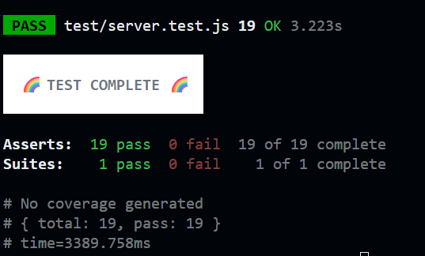

### TaskManger API


An API uses in memorydb for manage the tasks to perform CRUD.

First inorder check the test cases are working we need to change the certain thing in the given repo.

### create a server.js 
Help to seprate the app.js from listen on the port so test can start and keeps on running.

The server .js file contains the port it listening 


## SETUP 

`
git clone url 
`

**Start the API :**

In scripts 

dev : nodemon server.js 

`
 npm run dev
`
```bash
npm run dev
npm run test
```

```markdown
| Method | Endpoint     | Description          |
|--------|-------------|--------------------|
| GET    | /tasks      | Get all tasks       |
| POST   | /tasks      | Create a new task   |
| GET   | /tasks:id    | Get single tasks       |
| PUT    | /tasks:id    | Update task       |
| DELETE    | /tasks:id | delete task       |
| GET    | /tasks?compelete=true | only completed task |
```

<div style="color:red">
⚠️ Warning: Some Tests are written in way that it expect a fixed input example get:id.

```js
tap.test("GET /tasks/:id", async (t) => {
  const response = await server.get("/tasks/1");
  t.equal(response.status, 200);
  const expectedTask = {
    id: 1,
    title: "Set up environment",
    description: "Install Node.js, npm, and git",
    completed: true,
  };
  t.match(response.body, expectedTask);
  t.end();
});
```
⚠️
Inorder to pass this test we need to give the exact input atleast one time. beacuse it uses t.match();
so make default fixed task as test object .
</div>

<div style="color:Yellow">
Beacuse we have a fixed Test cases if we add sorting based on time and popularity filed the test case will get fail;
</div>


## Task Manager


**GET :**

Gell all task
```
http://localhost:3000/tasks
```
Result : Return all the Tasks

**GET**
get single task
```
http://localhost:3000/tasks/1
```
result : return id task
```json
{
    "id":1,
    "title": "New Task",
    "description":"hi",
    "completed":true

  }
```

**DELETE**
get single task Copy

```
http://localhost:3000/tasks/1
```

Result : Delete Successfully
```json
{
    "message": "success"
}
```

**POST**

Add a new task
```
http://localhost:3000/tasks
```

Body
raw (json)
```json
{
    "title": "New Task",
    "description":"hi",
    "completed":true
  }
```

**PUT**
update a task
```
http://localhost:3000/tasks/2
```

Body
raw (json)
```json
{
    "title": "New Task",
    "description":"hi",
    "completed":false

  }
```

**GET**
optinal query
```
http://localhost:3000/tasks?completed=true
```

**Query Params**


Return only true completed value


**Result**
```json
[
    {
        "id": 3,
        "title": "New Task",
        "description": "hi",
        "completed": true
    },
    {
        "id": 4,
        "title": "New",
        "description": "hi",
        "completed": true
    }
]

```
Final Test out.

